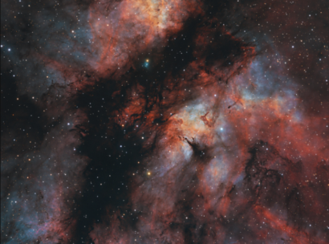

# 🚀 Space Travel Application

## 📱アプリ概要

  - 「コロナ禍でなかなか旅行に行けない。。。」　そんな悩みはありませんか？
  
  - _ならいっそ、「宇宙に飛び出しちゃおう💫」_
  
  
  - NASAのオープンソース、NASA APIから情報を取得して
  
  - 美しく、そして分かりやすく表現する、SwiftによるiOSアプリケーションです
  
  
## 環境

  - ●Swift
  
  - ●xcode / ver 13.4
  
  - ●RealmSwift / ver 2.0
  
  - ●SVProgressHUD / [github](https://github.com/SVProgressHUD/SVProgressHUD)
  
  - ●NASA API [NASA_API](https://api.nasa.gov/)
  
  
## 機能

   - ### Space Travel🚀
 
     
     - _好きな天体を選択すると、その天体に旅行できます_
     
     
     - セッション先 / [NASA_API](https://images-api.nasa.gov/search?q=earth)
     
   
   
   - ### Today's Astronomy💫
   
     
     - _日々NASAが更新する天文学に関する写真や記事を取得できます_
 
     
     - セッション先 / [NASA_API]([https://images-api.nasa.gov/search?q=earth](https://api.nasa.gov/planetary/apod?api_key=yourKey&date=20221212))
     
   
   
   - ### Today's Earth🌏
      
     
     - _日々NASAが更新する地球に関する写真や記事を取得できます_
 
     
     - セッション先 / [NASA_API]([https://api.nasa.gov/EPIC/api/natural/date/20220101?api_key=yourKey))
     
   
   - ### Tavel History📝
      
     
     - _渡航履歴を確認できます。もう一度そこに旅行することも可能です_
     
   
